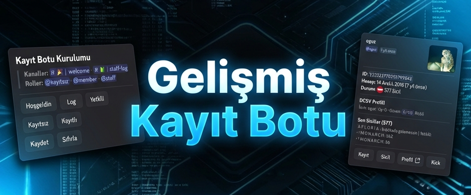

# 🛡️ DCSV Register Bot (Next-Gen)

<div align="center">
  
</div>

[](https://dcsv.me/)
[](https://nodejs.org/)
[](LICENSE)
[](https://github.com/dcsv-project)

**DCSV Register Bot**, Discord sunucuları için geliştirilmiş, **DCSV.ME API** altyapısını kullanan, ultra güvenli ve modern bir kayıt sistemidir. Karmaşık kodlarla uğraşmanıza gerek kalmadan, tek tıkla kurulum yapın ve sunucunuzun güvenliğini profesyonellere bırakın.

---

## 🚀 Neden DCSV Register?

Bu bot sıradan bir kayıt botu değildir. Sunucunuza katılan kullanıcıların **global sicilini (ban geçmişini)**, daha önceki sunuculardaki davranışlarını ve güven puanını analiz eder.

*   ✅ **Global Güvenlik:** Kullanıcıyı içeri almadan önce (DCSV veritabanından) sicilini kontrol eder.
*   ⚡ **Tek Tıkla Kurulum:** `.setup` komutu ile kod bilmeden kurulum.
*   🛡️ **Multi-Guild:** Tek bot ile sınırsız sunucu yönetimi.
*   🎨 **Premium Arayüz:** Göz yormayan, modern ve şık Discord Embed tasarımları.
*   🧹 **Sıfır Gereksiz Detay:** Cinsiyet, yaş gibi gereksiz verilerle uğraşmaz. Sade ve hızlı.

---

## ✨ Özellikler

*   **Otomatik Karşılama:** Yeni gelen üyeyi detaylı bir "Kimlik Kartı" ile karşılar.
*   **Sicil Kontrolü:** Üyenin güven puanını (0-100) ve yasaklanma geçmişini anında gösterir.
*   **Kolay Yönetim Paneli:** `.setup` komutu ile roller ve kanallar interaktif olarak ayarlanır.
*   **Butonlu İşlem:** Kayıt etme, Kickleme veya detaylı Profil görüntüleme işlemleri butonlarla yapılır.
*   **Loglama:** Yapılan tüm işlemler belirlediğiniz log kanalına detaylıca raporlanır.

---

## 🛠️ Kurulum

Botu kurmak için teknik bilgiye ihtiyacınız yok. Windows ve Linux için hazırladığımız özel scriptleri kullanabilirsiniz.

### 📋 Gereksinimler
*   [Node.js v18+](https://nodejs.org/) (Zorunlu)
*   Discord Bot Token ([Almak için tıkla](https://discord.com/developers/applications))
*   DCSV API Key (Opsiyonel ama önerilir)

### 🖥️ Windows İçin (En Kolay Yöntem)

1.  Projeyi indirin ve bir klasöre çıkartın.
2.  Klasör içindeki **`setup_win.bat`** dosyasına çift tıklayın.
3.  Sizden **Bot Token** isteyecektir, yapıştırıp Enter'a basın.
4.  Arkanıza yaslanın, gerisini script halledecek! Botunuz açılacaktır.

### 🐧 Linux / VDS İçin

Terminali açın ve aşağıdaki komutları sırasıyla girin:

```bash
# Script'e izin ver
chmod +x setup_linux.sh

# Kurulumu başlat
./setup_linux.sh
```

---

## ⚙️ Yapılandırma (Bot Komutları)

Botu sunucunuza ekledikten sonra ayar yapmak için kod dosyalarıyla uğraşmanıza gerek yok!

### 1. Ayar Menüsünü Açın
Sunucunuzda herhangi bir kanala şu komutu yazın:
> `.setup`

### 2. Rolleri ve Kanalları Seçin
Açılan menüde butonları kullanarak:
*   📢 **Hoşgeldin Kanalı:** Yeni gelenlerin karşılanacağı kanal.
*   📝 **Log Kanalı:** Kayıt işlemlerinin düşeceği kanal.
*   🎭 **Roller:** **Kayıtsız** (yeni gelene verilecek) ve **Kayıtlı** (kayıt olunca verilecek) rollerini seçin.

### 3. Kaydet
"Kaydet" butonuna basın ve kurulum bitti! 🎉

---

## 📁 Dosya Yapısı

Meraklısı için projenin dosya yapısı:

```
dcsv-register/
├── 📂 src/
│   ├── 📂 commands/       → Bot komutları (.setup vb.)
│   ├── 📂 events/         → Event dosyaları (giriş, mesaj vb.)
│   └── 📂 utils/          → Yardımcı araçlar (API, Database vb.)
├── 📄 config.js           → Genel ayarlar
├── 📄 package.json        → Proje bilgileri
├── 🚀 setup_win.bat       → Windows kurulum aracı
├── 🐧 setup_linux.sh      → Linux kurulum aracı
└── 📝 README.md           → Bu dosya
```

---

## ❓ Sıkça Sorulan Sorular

**S: Bot "Yetkin yok" diyor?**
C: `.setup` komutunu sadece sunucuda **Yönetici** yetkisi olanlar kullanabilir.

**S: DCSV API Key zorunlu mu?**
C: Hayır, zorunlu değil ancak botun tüm özelliklerinden (detaylı sicil sorgusu 20+ üzeri) faydalanmak için kullanmanız önerilir.

**S: Bot birden fazla sunucuda çalışır mı?**
C: Evet! Her sunucu için ayrı bir `data/guilds.json` kaydı tutulur. İstediğiniz kadar sunucuda kullanabilirsiniz.

---

## 📩 Destek & İletişim

Geliştirici: **DCSV Team**
Web: [dcsv.me](https://dcsv.me)
Discord: [discord.gg/dcsv](https://discord.gg/dcsv)

**Lisans:** MIT License - Açık kaynaklıdır, geliştirilebilir ve dağıtılabilir.
